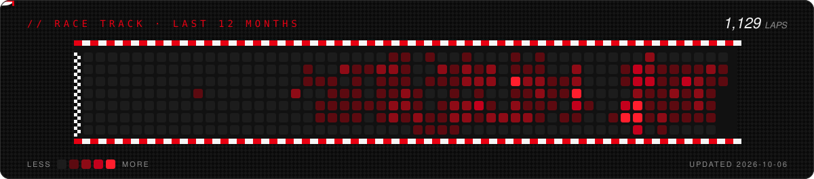

## 🏎️ Driver Card

## 📡 Telemetry

## 🏁 Race Track

## 🏆 Season Awards

## 🥇 Championship Standings

## 🔧 The Garage

**Engine** — languages

**Chassis** — frontend

**Powertrain** — backend

**Fuel system** — data & messaging

**Pit crew** — DevOps & testing

## 🏁 Season Highlights

| | Race | Setup |
|:-:|---|---|
| 🥇 | **Gov-tech platform API** — 430+ laps | Go · Fiber · PostgreSQL · Redis · RabbitMQ |
| 🥈 | **Education platform** monorepo — 340+ laps | Next.js · Hono · Prisma · MUI · Turborepo |
| 🥉 | **Work-permit management app** | React · tRPC · Prisma · Chakra UI |
| 🏎️ | **Membership & loyalty APIs** | Django · DRF · Celery · LINE |
| 🌱 | **Carbon / ESG reporting API** | Django · Wagtail · GraphQL · Celery · Azure |

Built at full throttle · 🔵🔷🔴

